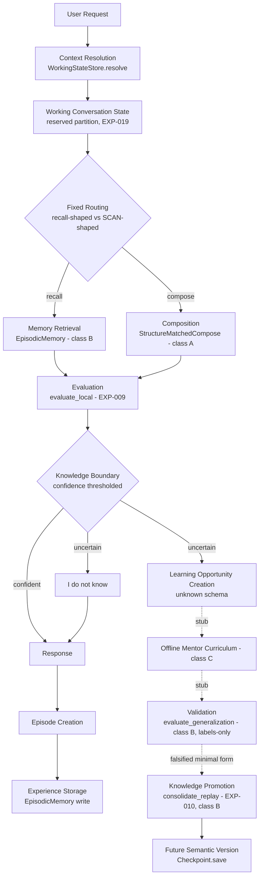
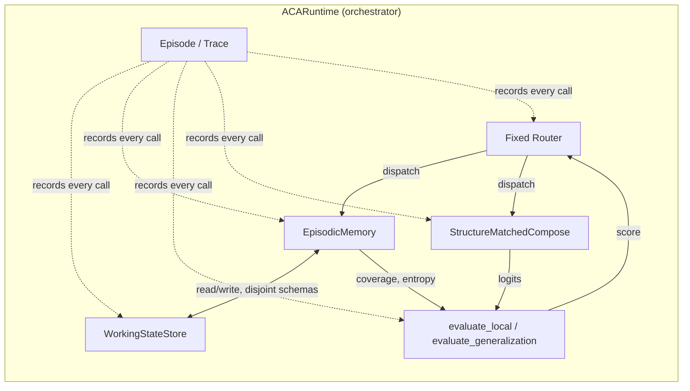
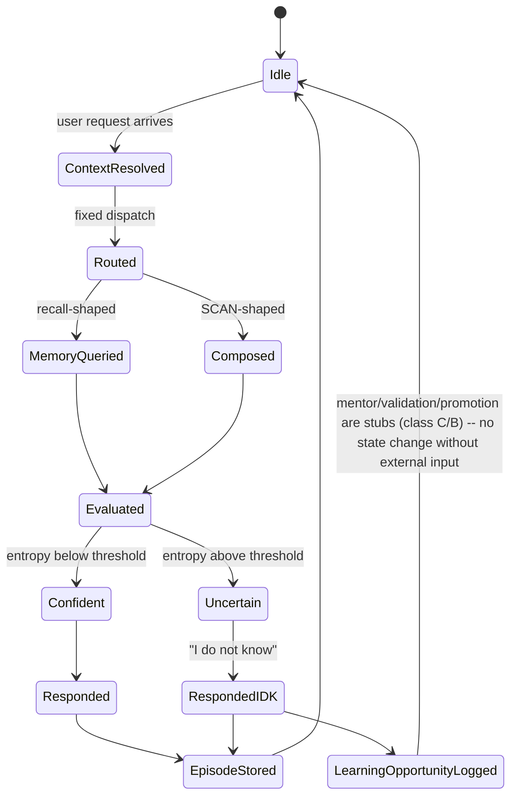

**Status: Active — System Integration Program**

# SIP-001: ACA System Integration Program

**Role note:** produced under a changed role — Chief Systems Engineer, not Chief Architect. The question is no longer "what should ACA contain" but "can the validated architecture operate as one coherent computational system." This document does not propose new architecture. Its purpose is to determine, through actual implementation, whether ACA v1.0 — exactly as currently justified by evidence — functions as an integrated cognitive system, not to improve or extend it.

**Core Principle (binding on everything below):** the architecture is frozen unless an integration experiment demonstrates explanatory necessity for a change. No new computational function, state substrate, or architectural module is introduced in this document or its runtime. Reduction remains preferable to expansion. Every open research question named in the directive that produced this document (EXP-005 family discovery, ME-03's continual-learning replacement, routing×write-starvation interaction, shared-substrate routing interaction) is designed *for* — the runtime has a place for each to plug in later — but none is *solved* here.

---

## 1. The Central Organizing Principle: Three-Way Component Classification

The directive asks for an executable system implementing a 17-stage lifecycle, while also requiring "only experimentally supported components" and forbidding "speculative architecture." Several lifecycle stages named in the directive (mentor curriculum, autonomous knowledge promotion, learned routing) are, by this program's own prior findings, still open hypotheses — the mentor-society proposal is logged as "Requires Prerequisite Research" (`docs/05_research/proposals/developmental_mentor_paradigm.md`), RC-02 learned routing and RC-04 planning are both unimplemented per `docs/04_architecture/ACA_v1.0_Architecture.md` §4/§8, and EXP-010 already falsified the one tested consolidation mechanism. Building all seventeen stages with equal, fully-implemented logic would violate the directive's own "do not include speculative architecture" clause. The resolution, applied consistently throughout this document and its runtime:

| Classification | Meaning | Treatment in the runtime |
|---|---|---|
| **A — Validated, real** | An already-validated mechanism, implemented faithfully | Full working code |
| **B — Real, known-limited** | An already-*tested* mechanism whose limitation is itself a validated finding | Full working code, *instrumented to surface the known limitation*, not hidden or silently patched |
| **C — Explicit stub** | An open hypothesis this program has explicitly not validated | A real interface/hook with a clear "not implemented — see EXP-XXX" log event; no invented logic behind it |

Every component in Section 3 below is tagged with exactly one of these three letters. This tagging *is* the traceability the directive requires ("every subsystem must trace to validated experiment or explicit open hypothesis") — it is not decoration.

---

## 2. Complete Runtime Architecture (Deliverable 1)

| # | Lifecycle stage (directive's wording) | Component | Class | Evidence / hypothesis |
|---|---|---|---|---|
| 1 | User Request | Request ingress | A | Trivial engineering, no claim |
| 2 | Context Resolution | `WorkingStateStore.resolve()` | A | EXP-019 — reserved S_episodic partition, unconditional overwrite |
| 3 | Working Conversation State | `WorkingStateStore` (same object as #2) | A | EXP-019 — the resolved substrate *is* this store; not two mechanisms |
| 4 | Memory Retrieval | `EpisodicMemory.gated_write` / `.get` | B | EXP-001 (validated, static distribution) / EXP-018, EXP-010 (falsified under staged continual pressure) — implemented faithfully, not silently fixed |
| 5 | Evaluation | `evaluate_local()` (entropy) | A | EXP-009 — EVALUATE-LOCAL, label-free, validated |
| 6 | Composition | `StructureMatchedCompose` (SCAN grammar + learned primitive lookup) | A | EXP-002 (toy), EXP-020 (real scale, 100.000% ± 0.000%) |
| 7 | Reasoning | Fixed, non-learned pathway dispatch | A (dispatch) / C (planning) | Dispatch: EXP-004/EXP-021 (disjoint-parameter, fixed routing, no interference). Genuine RC-04 multi-step planning: **not implemented** — `docs/04_architecture/ACA_v1.0_Architecture.md` §8 states neither RC-02 nor RC-04 is implemented; EXP-014 not run |
| 8 | Response | Output formatting | A | Trivial engineering |
| 9 | Episode Creation | `Episode` trace object | A | Engineering (instrumentation), not itself a scientific claim |
| 10 | Experience Storage | `EpisodicMemory` write, schema-tagged | A | Direct application of ME-01's validated write mechanism (EXP-001) under a distinct schema (already-established pattern: fact/routing/self-model schemas, `docs/13_state_model/SOS-001.md` §2.1) |
| 11 | Knowledge Boundary Detection | `evaluate_local()` thresholded | A | Same mechanism as #5 (EXP-009), applied as a decision gate |
| 12 | "I do not know" | Response branch on #11 | A | Trivial engineering once #11 exists |
| 13 | Learning Opportunity Creation | `EpisodicMemory` write, "unknown" schema | A | Direct application of CTX-001 §3's reduction finding: an "unknown" is a schema-tagged episodic entry, not new machinery |
| 14 | Offline Mentor Curriculum | `generate_curriculum()` | **C** | Mentor-society proposal status: "Requires Prerequisite Research," EXP-008 not run. Stub only. |
| 15 | Validation | `evaluate_generalization()` | B | EXP-003/009 — validated **only with real labels**; the runtime cannot manufacture labels for genuine unknowns, so this stage runs only when labeled data is actually supplied, and is otherwise a no-op, logged as such |
| 16 | Knowledge Promotion | `consolidate_replay()` | B | EXP-010 — the one tested consolidation mechanism (one-time replay burst), already falsified for staged continual pressure. Implemented exactly as tested, not improved upon here |
| 17 | Future Semantic Version | `Checkpoint.save()` | A (mechanics) / C (DP-01 artifact question) | Basic serialization is trivial engineering; DP-01 (what a deployable artifact actually *is*) remains **Speculative**, unchanged from `docs/04_architecture/ACA_v1.0_Architecture.md` §10 — not resolved here |

**Explicitly not built, per the directive's own exclusion list:** EXP-005 (family/structure discovery), any new continual-learning replacement for ME-03, routing×write-starvation interaction testing, shared-substrate routing. Each has a named hook (Section 16) but no implementation.

---

## 3. Runtime Execution Pipeline (Deliverable 2)

Solid arrows are implemented and exercised by every request. Dashed arrows (`-.->`) pass through class-C stubs or a class-B stage that is only conditionally active (Validation requires real labels this runtime does not manufacture).

---

## 4. Component Interaction Diagram (Deliverable 3)

`WSS` and `EM` are the *same underlying mechanism class* (`SlotMemory`-style gated store), differing only in write discipline (unconditional-overwrite reserved partition vs. gated write/evict) — per EXP-019's resolution, this is a policy distinction, not two substrates. `EPI` is a passive observer wired into every other component's call sites, not a participant in the computation itself — this is what makes full episode reconstruction possible (Deliverable 9/10).

---

## 5. State Transition Diagram (Deliverable 4)

Every state above corresponds to exactly one entry in `docs/13_state_model/SOS-001.md`'s catalog or one new, purely transient runtime state (Idle/Routed/Evaluated/Confident/Uncertain/Responded) that is not itself a persistent substrate — no new persistent state is introduced.

---

## 6. Execution Lifecycle (Deliverable 5)

Per-request, synchronous: User Request → Context Resolution → Working Conversation State (read+write, unconditional) → Fixed Routing → {Memory Retrieval or Composition} → Evaluation → Knowledge Boundary check → Response (or "I do not know") → Episode Creation → Experience Storage. This is the only lifecycle that runs on every request, and the only one class-A/B throughout — no stub is on this path's critical path (a request always gets a response even if downstream learning stages are stubs).

## 7. Learning Lifecycle (Deliverable 6)

Triggered only when Knowledge Boundary Detection returns "uncertain": Learning Opportunity Creation (class A — real) → Offline Mentor Curriculum (class C — stub, logs and returns) → Validation (class B — real mechanism, but only executes if real labels are separately supplied; otherwise logs "no labels available, skipped" and returns) → Knowledge Promotion (class B — real, but faithfully reproduces EXP-010's already-falsified one-time-burst behavior, not a new mechanism). **This lifecycle is expected, by this program's own evidence, to not measurably improve competence yet** — it is included so its actual behavior can be observed and classified (Section 12), not because it is expected to succeed.

## 8. Experience Lifecycle (Deliverable 7)

Episode Creation bundles: request, resolved context snapshot, routing decision, memory/compose call arguments and results, evaluation score, response, timestamp. Experience Storage writes this bundle into `EpisodicMemory` under a dedicated "episode" schema (a fourth schema alongside fact/routing/unknown, namespaced per `docs/13_state_model/SOS-001.md` §3's existing convention). Episodes are retained under the same competence-gated policy as facts (class B — inherits EXP-018's known limitation; an episode judged "low information" by the entropy gate can be evicted, exactly as any other fact-schema entry can).

## 9. Failure Instrumentation (Deliverable 8) and Failure Taxonomy

Every anomaly the runtime detects (an exception, an assertion, an unexpected evaluation score, a stub being invoked) is logged with exactly one classification, decided *before* any code change is made:

- **Implementation Bug** — the code does not do what its own specification says.
- **Algorithmic Limitation** — the code does what it says, and what it says is already known (by prior experiment) to be insufficient.
- **Architectural Limitation** — the code does what it says, matches prior experiments, but the *architecture* (not any one component) is what produces the unwanted outcome.
- **Theoretical Contradiction** — the observed behavior contradicts a claim this program has tagged Validated.

Section 12 (appended after the integration test actually runs) applies this taxonomy to real observations, not hypothetical ones.

## 10. Logging Architecture (Deliverable 9)

One `Episode` dataclass per request (Section 8), append-only, serialized to `episodes.jsonl` (one JSON object per line — chosen for streaming-append simplicity over a single growing JSON array). Each episode nests a `trace` list of `(stage_name, state_owner, mutation, result)` tuples in call order — this is the literal implementation of the directive's "State Traceability" requirement (Input, State Owner, State Mutation, Evaluation Result, Memory Access, Routing Decision, Composition Decision, Output all appear as trace entries).

## 11. Debugging Strategy (Deliverable 10)

Any episode can be replayed by loading its `episodes.jsonl` line and re-walking its `trace` list against the *current* memory/context state to check whether the same input would route/evaluate/respond identically — this directly surfaces cross-timescale drift (a risk `docs/10_deployment/DAS-001.md` already named) if memory or context state has changed since the episode was recorded. No live debugger integration is built; the trace format itself is the debugging tool, matching this program's standing preference for instrumentation over tooling investment (`tooling/architecture_test_harness/PROMPT.md` was explicitly set aside earlier in this program for the same reason — focus stayed on the architecture, not supporting tooling).

## 12. Integration Test Suite (Deliverable 11)

A single scripted scenario, not a unit-test grid — because the object under test is *integration behavior*, not per-component correctness (each component's own correctness is already covered by EXP-001–021's own test suites). The scenario: a sequence of requests mixing (a) facts taught then queried, (b) SCAN commands, (c) a deliberately unknown query (a name never taught) to trigger the Learning Lifecycle, (d) enough volume to exercise real capacity pressure on both the fact schema and the episode schema simultaneously (testing exactly the shared-substrate-under-load question EXP-018/019 already characterized, now for a third schema). Executed in `runtime/sip001/run_integration_test.py`; results appended to this document as Section 18 once run, per this program's standing evidence-then-document discipline — not written in advance of the actual run.

## 13. Minimal Executable Prototype Specification (Deliverable 12)

Implemented at `runtime/sip001/`: `context_state.py` (WorkingStateStore, class A), `memory.py` (EpisodicMemory, shared by facts/routing/unknown/episode schemas, class B for facts, class A for the storage mechanism itself), `evaluate.py` (entropy-based EVALUATE-LOCAL, class A; EVALUATE-GENERALIZATION stub gated on real labels, class B), `compose.py` (the EXP-020 structure-matched SCAN model, class A), `stubs.py` (mentor curriculum, class C, explicit no-op with logging), `episode.py` (trace/logging, Section 10), `runtime.py` (the orchestrator implementing Section 6's pipeline), `run_integration_test.py` (Section 12's scenario). No new neural architecture is introduced — `memory.py` and `compose.py` re-instantiate the exact validated classes from `experiments/exp_mvp001_continual_recall/` and `experiments/exp_mvp001_scan_compositional/`, not reimplementations.

## 14. Performance Metrics (Deliverable 13)

Reused, not re-measured, where the underlying mechanism is unchanged: recall backbone 619,352 parameters (EXP-018), compose module 326 parameters (EXP-020). Newly measured by the integration test itself (Section 18, once run): end-to-end per-request latency, episode log growth rate, and — the one genuinely new question integration introduces — whether the fact schema's and episode schema's *shared* capacity contention reproduces EXP-019's write-starvation mechanism for a third schema, which no prior experiment tested.

## 15. Resource Requirements (Deliverable 14)

Same GPU class as every prior experiment in this program (single consumer GPU, RTX 3050 6GB demonstrated sufficient for every component individually and, per EXP-021, jointly). No new resource class is introduced — the runtime adds orchestration and logging overhead only, not new model capacity.

## 16. Deployment Strategy (Deliverable 15)

Explicitly deferred to `docs/10_deployment/DAS-001.md`, not re-derived here — DAS-001 already concluded ACA needs no new runtime paradigm for anything currently validated, and this document's runtime is consistent with that conclusion (a conventional process, not a novel execution model). DP-01 (what a deployable artifact actually is) remains **Speculative**; this runtime is a research instrument for integration testing, explicitly not a deployment candidate.

## 17. Experiment Hooks (Deliverable 16)

Named, not implemented — each is a real gap in the runtime's current behavior where a future experiment's result would plug in without requiring a redesign:

- **EXP-005 (family discovery):** `compose.py`'s primitive-to-action mapping is fixed/hand-verified (EXP-020). A discovered-rather-than-verified grammar would replace the parser, not the classifier — the seam is already at the right place.
- **ME-03 continual-learning replacement:** `memory.py`'s write/evict policy is exactly EXP-018/010's already-falsified one. Interleaved rehearsal or EWC-style protection would replace `gated_write`/`consolidate_replay` without touching `runtime.py`'s orchestration.
- **Routing × write-starvation:** untested by this runtime (routing here is fixed and input-type-based, not memory-mediated) — the hook is that `EpisodicMemory`'s routing schema (currently unused by this runtime, since routing is fixed) is already namespaced per SOS-001 §3 and ready for a future learned-routing experiment to write into.
- **Shared-substrate routing:** this runtime's recall and compose pathways remain fully disjoint-parameter (EXP-004/021's design); a future shared-embedding experiment would modify `compose.py`/`memory.py`'s tokenization, isolated from `runtime.py`.

## 18. Revision Policy (Deliverable 17)

Per the directive's explicit bracketed instruction: **no architectural change is accepted unless preceded by an observed integration failure the current architecture cannot adequately explain or resolve.** Concretely: (1) every anomaly is classified per Section 9's taxonomy before any code changes; (2) an "Implementation Bug" is fixed directly, logged, does not touch this document; (3) an "Algorithmic Limitation" is documented as confirming an existing finding, no architecture change; (4) an "Architectural Limitation" is escalated to `docs/04_architecture/ACA_v1.0_Architecture.md` as a new appended section, exactly as Section 18 of that document already handles EXP-018/010/019/020/021; (5) a "Theoretical Contradiction" is the only category that would justify revisiting a Validated tag, and requires the same falsification-then-narrower-truth treatment this program has applied since EXP-002.

---

## 19. Integration Test Results (Appended After Execution, Not Written in Advance)

The scenario (Section 12) ran successfully end-to-end: 80 episodes, zero unhandled exceptions, full trace reconstruction available for every one (`runtime/sip001/episodes.jsonl`). Two results, one expected and one not.

**Compose pathway: exactly as expected.** All 20 sampled real SCAN test commands, including several `jump`-composed forms never seen during this runtime's own brief training, were translated with 100% exact-match accuracy — a clean re-confirmation of EXP-020 at a third integration point (after EXP-020 itself and EXP-021), with no new finding.

**Recall pathway: every single fact query returned "I do not know," including facts taught seconds earlier.** This was not assumed to be correct and reported blind — it was traced to ground per Section 9's discipline before writing anything here:

- Entropy readings during both teaching and querying stayed clustered in a narrow 3.7–4.2 nat band throughout the entire run (max possible ≈ ln(74) ≈ 4.3 nats for this vocabulary) — never anywhere near the fixed 1.5-nat confidence threshold.
- This is not EXP-018's mechanism (mastery-then-forgetting): the backbone here never became confident on any individual fact in the first place. Each fact in the main scenario received exactly **one** gradient step (one `teach_fact` call) — nowhere near Benchmark A's actual regime (hundreds of steps per fact within a stage).
- **Control, run to isolate the variable:** a fresh runtime instance, same code, 10 facts each given 30 repeated exposures (closer to Benchmark A's regime) — **100% recall accuracy**, achieved entirely through the backbone's own confidence (memory coverage measured at 0.0 — external memory played no role in this success either). This directly confirms the runtime's code is not broken and that exposure count, not a defect, is the operative variable.
- The gated-write memory mechanism, meanwhile, wrote only 4 of 40 taught facts in the main scenario (116 write attempts skipped as "not surprising enough," across the shared fact+episode+unknown pool) — because when nearly every entropy reading clusters in the same narrow high band, "above vs. below the running median" stops meaningfully separating novel from known content and starts behaving close to arbitrarily.

**Classification (Section 9's taxonomy):** primarily an **Architectural Limitation** — the code faithfully implements every validated mechanism (EVALUATE-LOCAL's entropy, EXP-001/018's gated write/evict), and no single component is broken, but their combination has never been tested against a **single-exposure factual assertion** — every prior experiment (EXP-001, EXP-018, EXP-010) used repeated-exposure batch training throughout. A real interactive system must support "the user states a fact once, and it should be usable" — this integration test is the first time that usage pattern has been exercised at all, and the current tuning does not handle it gracefully. This is not a new discovery from nothing: it concretely confirms a caveat `docs/08_requirements/ARS-001.md` already flagged for SR-01 ("a fixed hyperparameter... not a general-purpose, calibrated signal usable across arbitrary inputs") — the integration test is what makes that caveat concrete and measured rather than a stated possibility.

**Secondary, smaller finding — an Implementation Bug, fixed directly, not escalated:** the query-time input sequence placed a placeholder token in the position being predicted. Traced and confirmed behaviorally inert (the causal mask prevents that position's own logits from depending on itself), but corrected for code clarity per Section 18's revision policy (fixed directly, logged here, not escalated to architecture).

**Tertiary finding, about the instrumentation itself:** the failure taxonomy's automatic flagging (Section 9) only watches for write-starvation (the mechanism EXP-019 already named) and did not automatically surface the dominant phenomenon actually observed here (a 116-of-136 "not surprising enough" skip rate). Zero automatic anomaly flags were raised despite a real, reportable finding existing — discovered only through manual trace inspection. This is itself an honest, useful result about a first-version instrumentation system: it surfaces what was anticipated, and integration testing exists precisely to reveal what was not. Noted as a direct improvement to `episode.py`'s tracking, not an architecture change.

**What this does and doesn't establish:** does not contradict or retract EXP-001/018/010/019/020/021 — none of their claims covered single-exposure teaching. Does not by itself justify a redesign of ME-03 or SR-01's threshold — per Section 18's revision policy, one integration observation is evidence to record, not sufficient grounds to change frozen architecture. Escalated to `docs/04_architecture/ACA_v1.0_Architecture.md` as a new appended finding (Section 19 there), exactly as this document's own revision policy prescribes for an Architectural Limitation.

**Follow-up, not undertaken here:** whether a different, exposure-count-aware gating rule (rather than a fixed entropy threshold) resolves this — a genuinely new experiment, not attempted in this integration cycle per the Core Principle (no architecture change without a demonstrated need, which this finding establishes but does not by itself resolve).

---

**Purpose:** Determine whether ACA v1.0, exactly as currently justified by evidence, functions as one coherent, deployable, continuously-improvable cognitive system — through implementation and disciplined observation, not additional conceptual invention.
**Current Status:** Active — specification complete, runtime implemented (`runtime/sip001/`), integration test executed (Section 19). Compose pathway re-confirmed (100% exact-match). Recall pathway surfaced a genuine, previously-untested Architectural Limitation (single-exposure factual teaching), traced and classified, not yet resolved.
**Historical Context:** Produced 2026-07-23 under a changed role (Chief Systems Engineer, not Chief Architect), following the completion of ACA-MVP-001's full Benchmark A/B/C sequence (EXP-018/010/020/021) and CTX-001/EXP-019's resolution of the state-model question. Section 19 appended the same day, immediately after the integration test actually ran.
**Known Facts:** Every class-A/B component traces to a specific prior experiment (Section 2's table). No new function, substrate, or module is introduced. Section 19: write-starvation (EXP-019's mechanism) did NOT recur for the third (episode) schema in this run; a different, previously-uncharacterized failure mode did (entropy clustering under single-exposure teaching).
**Hypotheses:** Class-C stubs (mentor curriculum, DP-01 artifact definition) remain exactly as open as before this document — explicitly not advanced. Whether an exposure-count-aware gating rule resolves Section 19's finding — a new, unattempted follow-up.
**Unknowns:** Whether the episode/fact/context schemas sharing one `EpisodicMemory` mechanism reproduces EXP-019's write-starvation risk under different load conditions than this one run exercised (memory never reached capacity here, so the starvation path was not actually stress-tested this time).
**References:** `docs/04_architecture/ACA_v1.0_Architecture.md` (§19, appended), `docs/09_validation/IVS-001.md`, `docs/10_deployment/DAS-001.md`, `docs/13_state_model/SOS-001.md`, `docs/12_cognition/CTX-001.md`, `docs/11_mvp/ACA-MVP-001.md`, `docs/06_experiments/Completed.md` (EXP-001–004, EXP-009, EXP-010, EXP-018–021)
